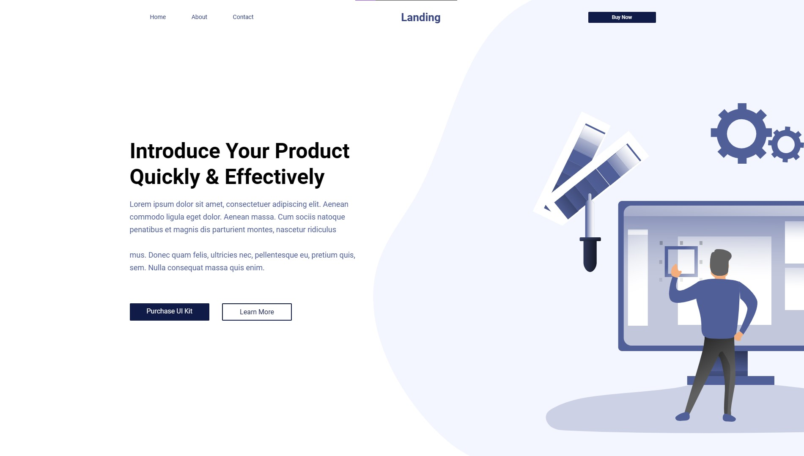

# Figma Website Template to HTML - Landing Page

Convert a Figma website template into a fully functional HTML landing page using React and Vite.

## About

This project aims to convert a Figma website template for a landing page into HTML code using React and Vite. By utilizing modern web development technologies, I create a responsive and interactive web page based on the design provided in Figma.

The design for this project can be found [here](https://www.figma.com/community/file/849342658995967505).

